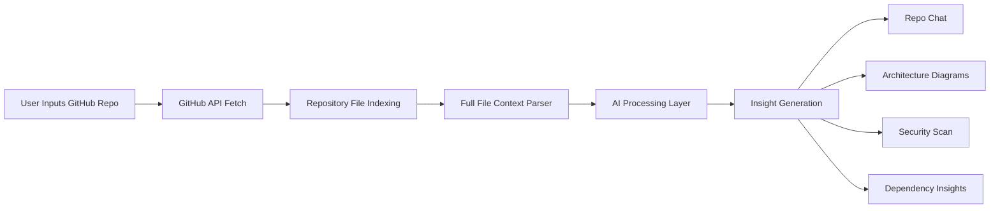
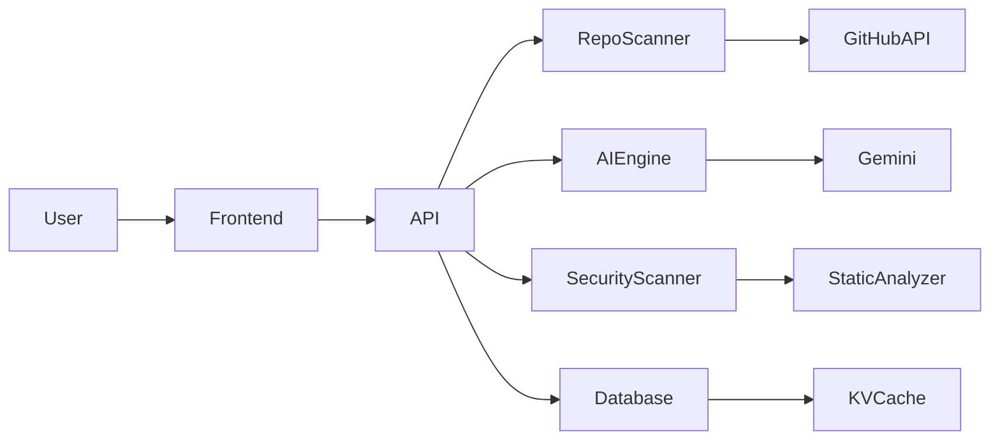

<div align="center">

# ⚡ GitPulse

### Dive into Open Source. Master Any Repo. Instantly.

An **AI-powered platform for understanding GitHub repositories and developer profiles**.

Chat with any repo, generate architecture diagrams, and run security scans — **without cloning the repository**.

<br>


<br><br>

**Understand any GitHub repository in seconds.**

</div>

---

# 🚀 What is GitPulse?

GitPulse converts any GitHub repository into an **interactive AI-powered knowledge system**.

Instead of manually exploring hundreds of files, developers can:

* Ask questions about the codebase
* Generate architecture diagrams
* Identify security vulnerabilities
* Understand dependencies and structure

All directly **inside the browser**.

GitPulse performs analysis using **GitHub APIs + full-file context reasoning**, enabling deeper insights compared to traditional code search.

---

# ✨ Core Features

<div align="center">

| 🔍 Repo Intelligence             | 💬 Chat With Code         | 📊 Architecture Insights       |
| -------------------------------- | ------------------------- | ------------------------------ |
| Understand entire repo instantly | Ask questions about code  | Generate architecture diagrams |
| Full-file context analysis       | Locate logic across files | Visualize dependencies         |
| Detect patterns & structure      | Explain complex systems   | Flowcharts from real code      |

</div>

<br>

<div align="center">

| 🛡 Security Scanning      | 👨‍💻 Developer Insights   | ⚡ Instant Repo Analysis |
| ------------------------- | -------------------------- | ----------------------- |
| Detect vulnerabilities    | Analyze developer profiles | No cloning required     |
| Find hardcoded secrets    | View contribution patterns | Works via GitHub APIs   |
| Dependency risk detection | Explore top repositories   | Instant analysis        |

</div>

---

# 📸 Application Gallery

<div align="center">

A quick visual walkthrough of **GitPulse** and its capabilities.

</div>

---

<div align="center">

<table>

<tr>

<td align="center">

<br>
<b>Landing Experience</b>
</td>

<td align="center">

<br>
<b>Repository Chat</b>
</td>

</tr>

<tr>

<td align="center">

<br>
<b>Security Scan</b>
</td>

<td align="center">

<br>
<b>Architecture Diagrams</b>
</td>

</tr>

<tr>

<td align="center">

<br>
<b>Repo Intelligence</b>
</td>

<td align="center">

<br>
<b>Developer Profile Analysis</b>
</td>

</tr>

<tr>

<td align="center">

<br>
<b>Dependency Visualization</b>
</td>

<td align="center">

<br>
<b>AI Repository Insights</b>
</td>

</tr>

</table>

</div>

---

# 🧠 Repository Analysis Pipeline



### Explanation

1️⃣ A user submits a **GitHub repository or profile**.

2️⃣ GitPulse retrieves repository data through the **GitHub API**.

3️⃣ The system builds a **file index and dependency graph**.

4️⃣ Each file is analyzed using **full-file context parsing** instead of fragmented chunks.

5️⃣ AI models analyze:

* architecture patterns
* module relationships
* dependency flows
* security risks

6️⃣ The results are transformed into:

* interactive chat answers
* architecture diagrams
* security reports
* dependency insights

---

# 🏗 System Architecture



### Explanation

**Frontend**

Built using **Next.js + React**, providing UI for:

* repo chat
* diagrams
* security reports
* developer insights

---

**API Layer**

Handles orchestration of:

* repo fetching
* AI prompts
* analysis pipelines
* caching

---

**Repository Scanner**

Uses **GitHub API** to retrieve:

* repository metadata
* file structure
* dependencies

---

**AI Engine**

Gemini models analyze repository code to:

* explain logic
* generate diagrams
* answer developer queries

---

**Security Scanner**

Performs static analysis to detect:

* SQL injections
* hardcoded secrets
* unsafe code patterns
* dependency vulnerabilities

---

**Database + Cache**

Prisma stores application data while **Vercel KV** provides caching to speed up repeated analysis.

---

# ⚙️ Getting Started

### Prerequisites

* Node.js **18+**
* GitHub Token
* Gemini API Key

---

### Installation

```bash
git clone https://github.com/YOUR_USERNAME/gitPulse.git

cd gitPulse

npm install
```

---

### Environment Setup

Create `.env.local`

```
GITHUB_TOKEN=
GEMINI_API_KEY=
DATABASE_URL=
```

---

### Start Development Server

```bash
npm run dev
```

Open in browser:

```
http://localhost:3000
```

---

# 🧪 Available Commands

```
npm run dev      # start development server
npm run build    # production build
npm run lint     # lint code
npm run test     # run tests
```

---

# 🔮 Roadmap

Planned improvements:

* repository dependency graphs
* pull request intelligence
* advanced vulnerability scanning
* multi-repo analysis
* issue & discussion insights

---

<div align="center">

# 👨‍💻 Author

**Raghav Sharma**

⭐ If you like the project, consider giving it a star!

</div>
