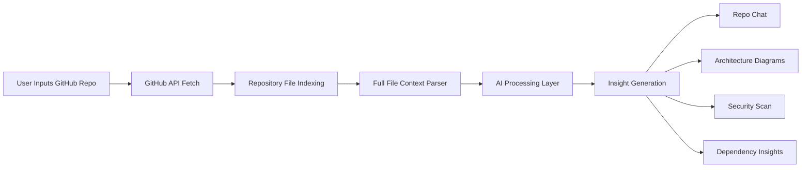
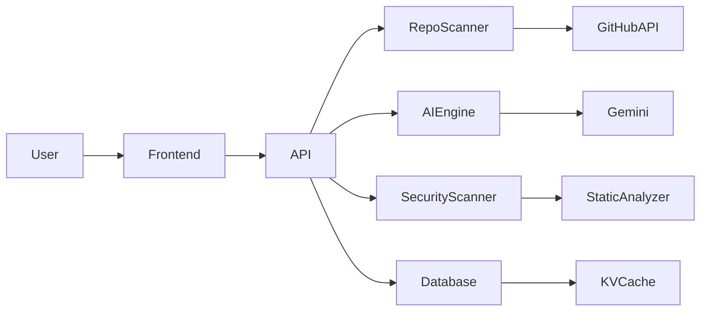

<div align="center">

# ⚡ GitPulse

### Dive into Open Source. Master Any Repo. Instantly.

An **AI-powered platform for understanding GitHub repositories and developer profiles**.

Chat with any repo, generate architecture diagrams, and run security scans — **without cloning the repository**.

<br>


<br><br>

**Understand any GitHub repository in seconds.**

</div>

---

# 🚀 What is GitPulse?

GitPulse converts any GitHub repository into an **interactive AI-powered knowledge system**.

Instead of manually exploring hundreds of files, developers can:

* Ask questions about the codebase
* Generate architecture diagrams
* Identify security vulnerabilities
* Understand dependencies and structure

All directly **inside the browser**.

---

# ✨ Core Features

<div align="center">

| 🔍 Repo Intelligence             | 💬 Chat With Code         | 📊 Architecture Insights       |
| -------------------------------- | ------------------------- | ------------------------------ |
| Understand entire repo instantly | Ask questions about code  | Generate architecture diagrams |
| Full-file context analysis       | Locate logic across files | Visualize dependencies         |
| Detect patterns & structure      | Explain complex systems   | Flowcharts from real code      |

</div>

<br>

<div align="center">

| 🛡 Security Scanning      | 👨‍💻 Developer Insights   | ⚡ Instant Repo Analysis |
| ------------------------- | -------------------------- | ----------------------- |
| Detect vulnerabilities    | Analyze developer profiles | No cloning required     |
| Find hardcoded secrets    | View contribution patterns | Works via GitHub APIs   |
| Dependency risk detection | Explore top repositories   | Instant analysis        |

</div>

---

# 📸 Application Gallery

<div align="center">

A quick visual walkthrough of **GitPulse** and its capabilities.

</div>

<br>

<div align="center">

<table>

<tr>

<td align="center">

<br><b>Landing Experience</b>
</td>

<td align="center">

<br><b>Repository Chat</b>
</td>

</tr>

<tr>

<td align="center">

<br><b>Architecture Insights</b>
</td>

<td align="center">

<br><b>Security Scanning</b>
</td>

</tr>

<tr>

<td align="center">

<br><b>Developer Insights</b>
</td>

<td align="center">

<br><b>Dependency Visualization</b>
</td>

</tr>

<tr>

<td align="center">

<br><b>AI Repository Understanding</b>
</td>

<td align="center">

<br><b>Interactive Repo Insights</b>
</td>

</tr>

</table>

</div>

---

# 🧠 Repository Analysis Pipeline



### Explanation

GitPulse analyzes repositories using **full-file context instead of fragmented code chunks**.

1. User submits a repository
2. GitHub API retrieves repository structure
3. Files are indexed and parsed
4. AI models analyze architecture and patterns
5. Insights are generated for chat, diagrams, and security reports

---

# 🏗 System Architecture



### Explanation

**Frontend**

Next.js interface for interacting with repositories.

**API Layer**

Handles repository fetching, AI orchestration, and caching.

**Repo Scanner**

Retrieves files using GitHub APIs.

**AI Engine**

Uses Gemini to reason about repository structure.

**Security Scanner**

Performs static code analysis.

---

# ⚙️ Getting Started

### Prerequisites

* Node.js 18+
* GitHub Token
* Gemini API Key

---

### Installation

```bash
git clone https://github.com/YOUR_USERNAME/gitPulse.git
cd gitPulse
npm install
```

---

### Environment Setup

Create `.env.local`

```
GITHUB_TOKEN=
GEMINI_API_KEY=
DATABASE_URL=
```

---

### Start Development Server

```
npm run dev
```

Open

```
http://localhost:3000
```

---

# 🔮 Roadmap

* repository dependency graphs
* pull request intelligence
* multi-repo analysis
* deeper vulnerability scanning

---

<div align="center">

# 👨‍💻 Author

**Raghav Sharma**

⭐ If you like this project, consider giving it a star!

</div>
